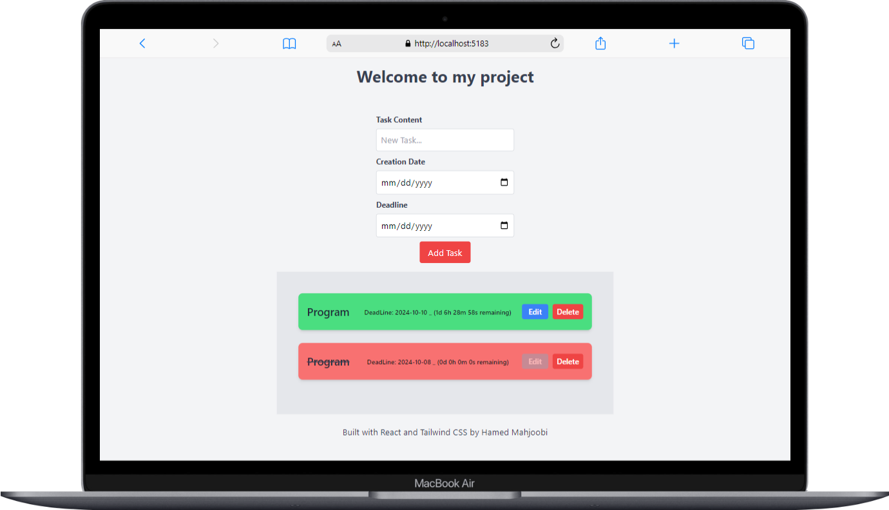

# React + Vite

## Project for Adding a To-Do List with Three Inputs: One for the text, one for the creation date, and the other for the deadline date. The texts have the ability to be moved, edited, and deleted while handling potential errors. For example, if the deadline date is earlier than the creation date, an error is triggered. If the created text surpasses the deadline date, the background color changes, and the ability to edit the text is removed. Additionally, a countdown timer is implemented from the creation date to the deadline date to enhance the accuracy of work management.

